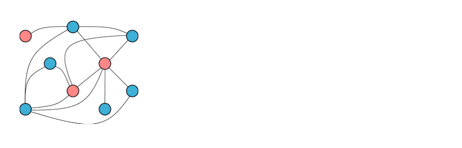

<div align="center">
  <a href="https://github.com/coupa/graphrag-lite">
    <picture>
      <source media="(prefers-color-scheme: dark)" srcset="images/graph-lite.png">
      
    </picture>
  </a>
  <p><strong>A light-weight and naive Python implementation of the GraphRAG algorithm</strong></p>
</div>

This project aims to offer an easy-to-follow, fully asynchronous implementation of the [GraphRAG](https://arxiv.org/pdf/2404.16130) algorithm.

While Microsoft's [original implementation](https://github.com/microsoft/graphrag) can be challenging to grasp due to limited documentation, this light-weight version provides comprehensive, clear explanations for every essential graphrag operation (these essential operations are grouped in src.graph_ops.py and src.rag_ops.py). The goal is for this repository to serve as a helpful foundation for anyone at Coupa looking to experiment with or fine-tune a GraphRAG application for their specific needs and use cases.

## At a high level, graphrag works in the following two major steps:

<details>
<summary> Knowledge Graph Building </summary>

- Chunkify document into text chunks of fixed token size
- For each text chunk, prompt an LLM to extract **entity** (person, company, org, etc.) and **relationship** (i.e. Person A is an employee of company B). An enity and relationship with their attributes are treated as a **node** and an **edge** in a **knowledge graph**, respectively.
- The same enity or relationship can appear in multiple text chunks, we summarize and merge these multiple instances into a single representation by sending all these instances as context to a LLM and prompt it to provide a concise and non-conflicting summarization
- We insert and update all merged entities and edges store them in a NetworkXX gragh object
- We then discover all the community/clsuter of the knowledge graph using the hierachical leiden cluster algorithm
- We use LLM again to generate a community level summary for each cluster using all the contained entity and relationship info as context
- We also embed all nodes' description into vectors and store these in a vector database

In the process of building a knowledge graph, we break down the information in a document into three levels of granularity: text chunk, node & edge, and community. Each level provides a higher-level summary that captures the context of the details from the level below it.
</details>

<details>
<summary> Retrieval Augumented Generation </summary>

- When a user query is received, we embed the query into vector and use vector search to determine top-K most related entities
- We then concatenate the summarized context from all three levels of information—text chunks, nodes & edges, and communities—related to the top-K similar nodes into a single comprehensive context for an LLM. This approach ensures that the model has a richer, more detailed understanding for generating responses. In contrast, RAG relies solely on the lowest level of information, which is the text chunk level, for generating responses.
</details>

The `src.graph_ops.py` contain all the ops for building a knowledge graph and `src.rag_ops.py` contains all RAG operation for question and answering.

This implementation is designed to be fully self-contained and highly customizable. You won't need to rely on external services for manipulating, storing, or searching vectors, or for handling and storing knowledge graph objects. Everything you need is included, allowing for complete customization according to your requirements.

All tunable model parameters are included in src.config.py. Please feel free to experiment with them.

You can also refer to example.py to see how gragh-rag is applied to a simple legal document understanding use case.

## Example local and global search responses
In the `example.py`, we have performed information retrieval task on a SECURITY AGREEMENT between many parties. There are two queries being requested. For the first query, the local RAG search of the knowledge graph is used. 

### local search
````
query_1: Exhaustively List all clauses in the contract, summarize their contents and also list their the relevant section.


To answer Query 1, one must review nearly all sections of the document to create a comprehensive summary. This is not feasible using a text-chunk-based naive RAG search. Additionally, sending the entire document as a single context is impractical, as it can quickly exceed the limited token limit. However, GraphRAG can address both of these shortcomings. The response to Query 1 generated by GraphRAG is shown below; as you can see, it provides a very good summary.


response of query_1:
The contract, known as the Security Agreement, contains several clauses that outline the rights, obligations, and legal framework governing the involved parties. Here is an exhaustive list of the clauses, along with a summary of their contents and the relevant sections:

1. **Section 1.1 - Recitals**
   - This section contains the recitals of the Security Agreement, affirming the truth and correctness of the statements made in the agreement.

2. **Section 1.2 - Interpretations**
   - Provides interpretations of terms used in the Security Agreement, ensuring clarity and understanding of the document's language.

3. **Section 3.2 - Secured Party May Perform**
   - Outlines the Secured Party's right to perform agreements if the Company fails to do so, with expenses included in the Obligations secured by the Agreement.

4. **Section 4.1 - Authorization; Enforceability**
   - Represents and warrants that all necessary actions have been taken to authorize the execution, delivery, and performance of the Agreement and the transactions contemplated hereby.

5. **Section 6.1 - Existence, Properties, Etc.**
   - Specifies the affirmative covenants of the Company regarding its existence, properties, and corporate power, ensuring the maintenance of the Company's organization and valid existence.

6. **Section 6.9 - Company's Obligations Regarding Compliance**
   - Specifies the Company's obligations regarding compliance with laws, regulations, and agreements, ensuring adherence to legal and regulatory requirements.

7. **Section 8.1 - Requirements for Notices or Other Communications**
   - Refers to the requirements for notices or other communications in writing, including the methods and timelines for delivery.

8. **Section 8.3 - Expenses**
   - Outlines the Company's obligation to pay expenses, including reasonable fees and expenses of its counsel, incurred by the Secured Party in connection with the Agreement.

9. **Section 8.4 - Waivers, Amendments, Etc.**
   - Addresses waivers, amendments, and the Secured Party's rights to demand strict compliance and performance, indicating a legal relationship with Section 8.3.

10. **Section 8.8 - Waiver of Jury Trial**
    - Waives the right to a trial by jury in any legal proceeding related to the Agreement and related documents.

11. **Section 8.9 - Entire Agreement**
    - Confirms that the Agreement constitutes the entire agreement among the parties and supersedes any prior agreement or understanding.

These clauses cover a wide range of legal and financial aspects, including authorization, obligations, compliance, communications, and dispute resolution, providing a comprehensive framework for the rights and responsibilities of the involved parties.
````

### global search
For the second query, a global search is used.
````
query_2: Provide a comprehensive summary of the contract so that a legal personnel does not need to read through it to understand all important information of the contract

Similarly, to answer this query, a holistic understanding of the document is required.

response of query_2 by GraphRAG:

### Summary of Contract Analysis

#### Pledged Property and Security Interest
The Secured Party holds a security interest and lien upon the Pledged Property of the Company, with specific rights and obligations related to the Pledged Property and security interest. The Obligations are secured by the Pledged Property and include amounts payable to the Secured Party, as well as the duties or responsibilities of the Company related to the agreement and the Secured Party. The Convertible Debentures are related to the Pledged Property, with provisions for termination and return, and the occurrence of an Event of Default triggers specific actions and authorities for the Secured Party.

#### Insurance and Compliance
The Company is required to maintain insurance at its own expense, with specific requirements and conditions, and is obligated to comply with applicable laws in connection with the disposition of the Pledged Property. The Company's representation and warranty regarding the ownership of the Pledged Property free and clear of any lien, except for those permitted under the Agreement, is also a crucial aspect.

#### Parties and Agreements
The Security Agreement involves parties such as Cornell Capital Partners, LP, Fernley Gold Inc., Nevada Rae Gold Inc., Oregon Gold, Inc., Pacific Metals Corp., Pilot Mountain Resources, and Yorkville Advisors, LLC, with specific clauses and sections outlining the Company's obligations, rights, and affirmative covenants. The Security Agreement constitutes the entire agreement among the parties and includes clauses with legal and financial implications for the involved parties.

#### Legal and Financial Implications
The legal and financial implications of the relationships within this community are significant, given the complex nature of the agreements and transactions involving the Secured Party, Pledged Property, and the Company. The Security Agreement involves legal implications and obligations that are significant in understanding the impact of this community, with parties such as Nevada Rae Gold Inc., Pacific Metals Corp., Pilot Mountain Resources, Cornell Capital Partners, L.P., and Yorkville Advisors, LLC being parties to the Agreement.

In conclusion, the Security Agreement encompasses various critical aspects such as the Pledged Property, obligations, insurance, compliance, involved parties, and the legal and financial implications, making it essential for a comprehensive understanding of the contractual obligations and rights.
````
